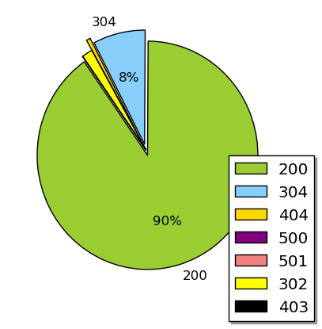
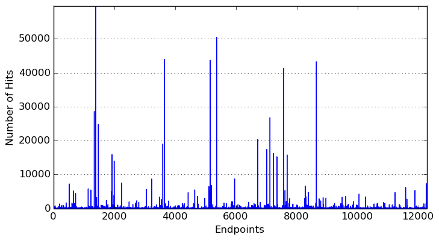
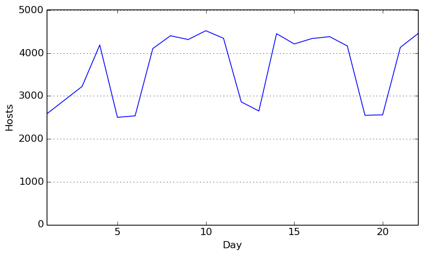
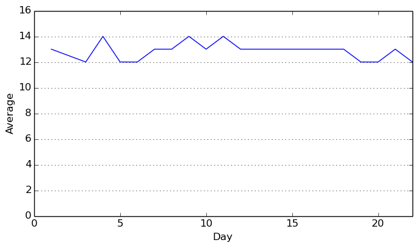
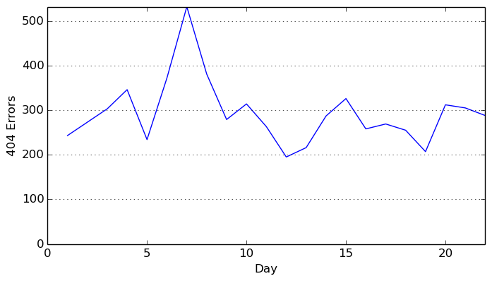
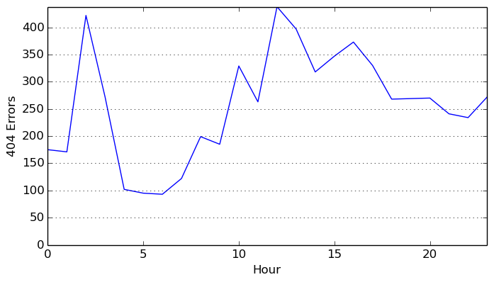

version 1.0.1
# + 
# **Web Server Log Analysis with Apache Spark**
 
####This report demonstrate how easy it is to perform web server log analysis with Apache Spark.
 
####Server log analysis is an ideal use case for Spark.  It's a very large, common data source and contains a rich set of information.  Spark allows you to store your logs in files on disk cheaply, while still providing a quick and simple way to perform data analysis on them.  This homework will show you how to use Apache Spark on real-world text-based production logs and fully harness the power of that data.  Log data comes from many sources, such as web, file, and compute servers, application logs, user-generated content,  and can be used for monitoring servers, improving business and customer intelligence, building recommendation systems, fraud detection, and much more.

### **Part 1: Apache Web Server Log file format**
####The log files that we use for this assignment are in the [Apache Common Log Format (CLF)](http://httpd.apache.org/docs/1.3/logs.html#common). The log file entries produced in CLF will look something like this:
`127.0.0.1 - - [01/Aug/1995:00:00:01 -0400] "GET /images/launch-logo.gif HTTP/1.0" 200 1839`
 
####Each part of this log entry is described below.
* `127.0.0.1`
####This is the IP address (or host name, if available) of the client (remote host) which made the request to the server.
 
* `-`
####The "hyphen" in the output indicates that the requested piece of information (user identity from remote machine) is not available.
 
* `-`
####The "hyphen" in the output indicates that the requested piece of information (user identity from local logon) is not available.
 
* `[01/Aug/1995:00:00:01 -0400]`
####The time that the server finished processing the request. The format is:
`[day/month/year:hour:minute:second timezone]`
  * ####day = 2 digits
  * ####month = 3 letters
  * ####year = 4 digits
  * ####hour = 2 digits
  * ####minute = 2 digits
  * ####second = 2 digits
  * ####zone = (\+ | \-) 4 digits
 
* `"GET /images/launch-logo.gif HTTP/1.0"`
####This is the first line of the request string from the client. It consists of a three components: the request method (e.g., `GET`, `POST`, etc.), the endpoint (a [Uniform Resource Identifier](http://en.wikipedia.org/wiki/Uniform_resource_identifier)), and the client protocol version.
 
* `200`
####This is the status code that the server sends back to the client. This information is very valuable, because it reveals whether the request resulted in a successful response (codes beginning in 2), a redirection (codes beginning in 3), an error caused by the client (codes beginning in 4), or an error in the server (codes beginning in 5). The full list of possible status codes can be found in the HTTP specification ([RFC 2616](https://www.ietf.org/rfc/rfc2616.txt) section 10).
 
* `1839`
####The last entry indicates the size of the object returned to the client, not including the response headers. If no content was returned to the client, this value will be "-" (or sometimes 0).
 
####Note that log files contain information supplied directly by the client, without escaping. Therefore, it is possible for malicious clients to insert control-characters in the log files, *so care must be taken in dealing with raw logs.*
 
### NASA-HTTP Web Server Log
####We will use a data set from NASA Kennedy Space Center WWW server in Florida. The full data set is freely available (http://ita.ee.lbl.gov/html/contrib/NASA-HTTP.html) and contains two month's of all HTTP requests. We are using a subset that only contains several days worth of requests.

### The next steps was:
### **(1a) Parsing Each Log Line**
### **(1b) Configuration and Initial RDD Creation**
### **(1c) Data Cleaning**
#### On the dataset, there are a large number of log lines that failed to parse. we use the regularized expression for solve this problem. 
 
`127.0.0.1 - - [01/Aug/1995:00:00:01 -0400] "GET /images/launch-logo.gif HTTP/1.0" 200 1839`
 

### **Part 2: Sample Analyses on the Web Server Log File**
 
####Now it's time to perform analyses.
  
####Let's compute some statistics about the sizes of content being returned by the web server. In particular, we'd like to know what are the average, minimum, and maximum content sizes.
####So, lets visualize the results from the last example. We can visualize the results from the last example using [`matplotlib`](http://matplotlib.org/). First we need to extract the labels and fractions for the graph. We do this with two separate `map` functions with a `lambda` functions. The first `map` function extracts a list of of the response code values, and the second `map` function extracts a list of the per response code counts  divided by the total size of the access logs. Next, we create a figure with `figure()` constructor and use the `pie()` method to create the pie plot.

#### Frequent Hosts**
####Let's look at hosts that have accessed the server multiple times (e.g., more than ten times). As with the response code analysis in (2b), first we create a new RDD by using a `lambda` function to extract the `host` field from the `access_logs` RDD using a pair tuple consisting of the host and 1 which will let us count how many records were created by a particular host's request. Using the new RDD, we perform a `reduceByKey` function with a `lambda` function that adds the two values. We then filter the result based on the count of accesses by each host (the second element of each pair) being greater than ten. Next, we extract the host name by performing a `map` with a `lambda` function that returns the first element of each pair. Finally, we extract 20 elements from the resulting RDD - *note that the choice of which elements are returned is not guaranteed to be deterministic.*
#### **Visualizing Endpoints**
####Now, lets visualize the number of hits to endpoints (URIs) in the log. To perform this task, we first create a new RDD by using a `lambda` function to extract the `endpoint` field from the `access_logs` RDD using a pair tuple consisting of the endpoint and 1 which will let us count how many records were created by a particular host's request. Using the new RDD, we perform a `reduceByKey` function with a `lambda` function that adds the two values. We then cache the results. 

#### Top Endpoints**
####For the final example, we'll look at the top endpoints (URIs) in the log. To determine them, we first create a new RDD by using a `lambda` function to extract the `endpoint` field from the `access_logs` RDD using a pair tuple consisting of the endpoint and 1 which will let us count how many records were created by a particular host's request. Using the new RDD, we perform a `reduceByKey` function with a `lambda` function that adds the two values. We then extract the top ten endpoints by performing a [`takeOrdered`](http://spark.apache.org/docs/latest/api/python/pyspark.html#pyspark.RDD.takeOrdered) with a value of 10 and a `lambda` function that multiplies the count (the second element of each pair) by -1 to create a sorted list with the top endpoints at the bottom.

    Top Ten Endpoints: [(u'/images/NASA-logosmall.gif', 59737), (u'/images/KSC-logosmall.gif', 50452), (u'/images/MOSAIC-logosmall.gif', 43890), (u'/images/USA-logosmall.gif', 43664), (u'/images/WORLD-logosmall.gif', 43277), (u'/images/ksclogo-medium.gif', 41336), (u'/ksc.html', 28582), (u'/history/apollo/images/apollo-logo1.gif', 26778), (u'/images/launch-logo.gif', 24755), (u'/', 20292)]

### **Part 3: Analyzing Web Server Log File**
 
####Now it is your turn to perform analyses on web server log files.

#### **Top Ten Error Endpoints**
####What are the top ten endpoints which did not have return code 200? Create a sorted list containing top ten endpoints and the number of times that they were accessed with non-200 return code.
 
    Top Ten failed URLs: [(u'/images/NASA-logosmall.gif', 8761), (u'/images/KSC-logosmall.gif', 7236), (u'/images/MOSAIC-logosmall.gif', 5197), (u'/images/USA-logosmall.gif', 5157), (u'/images/WORLD-logosmall.gif', 5020), (u'/images/ksclogo-medium.gif', 4728), (u'/history/apollo/images/apollo-logo1.gif', 2907), (u'/images/launch-logo.gif', 2811), (u'/', 2199), (u'/images/ksclogosmall.gif', 1622)]

#### **Number of Unique Hosts**
####How many unique hosts are there in the entire log?
 
    Unique hosts: 54507

#### **Number of Unique Daily Hosts**
####For an advanced exercise, let's determine the number of unique hosts in the entire log on a day-by-day basis. This computation will give us counts of the number of unique daily hosts. We'd like a list sorted by increasing day of the month which includes the day of the month and the associated number of unique hosts for that day. Make sure you cache the resulting RDD `dailyHosts` so that we can reuse it in the next exercise.
 
    Unique hosts per day: [(1, 2582), (3, 3222), (4, 4190), (5, 2502), (6, 2537), (7, 4106), (8, 4406), (9, 4317), (10, 4523), (11, 4346), (12, 2864), (13, 2650), (14, 4454), (15, 4214), (16, 4340), (17, 4385), (18, 4168), (19, 2550), (20, 2560), (21, 4134), (22, 4456)]

#### **Visualizing the Number of Unique Daily Hosts**
####Using the results from the previous section, we use `matplotlib` to plot a "Line" graph of the unique hosts requests by day.

#### **Average Number of Daily Requests per Hosts**
####Next, let's determine the average number of requests on a day-by-day basis. We'd like a list by increasing day of the month and the associated average number of requests per host for that day. Make sure you cache the resulting RDD `avgDailyReqPerHost` so that we can reuse it in the next exercise.

    Average number of daily requests per Hosts is [(1, 13), (3, 12), (4, 14), (5, 12), (6, 12), (7, 13), (8, 13), (9, 14), (10, 13), (11, 14), (12, 13), (13, 13), (14, 13), (15, 13), (16, 13), (17, 13), (18, 13), (19, 12), (20, 12), (21, 13), (22, 12)]

#### **Visualizing the Average Daily Requests per Unique Host**
####Using the result from the previous section, we use `matplotlib` to plot a "Line" graph of the average daily requests per unique host by day.

### **Part 4: Exploring 404 Response Codes**
 
####Let's drill down and explore the error 404 response code records. 404 errors are returned when an endpoint is not found by the server (i.e., a missing page or object).

#### **Counting 404 Response Codes**
#### How many 404 records are in the log?

    Found 6185 404 URLs

#### **Exercise: Listing 404 Response Code Records**

    404 URLS: [(u'/11/history/apollo/images/', 1), (u'/128.159.104.89/tv/tv.html', 1), (u'/imag', 1), (u'/shuttle/missionssts-70/woodpecker.html', 1), (u'/~terrig/bookmark.html', 3), (u'/elv/ATLAS_CENTAUR/p-ae.gif', 2), (u'/pub.win', 1), (u'/ksc.nasa.gov/images/ksclogo-medium.gif', 1), (u'/history/apollo-13', 1), (u'/shuttle/missioins/sts-70/movies/', 2), (u'/shuttle/missions/sts-69/mission-sts-74.html', 1), (u'/shuttle/missions/sts-80/mission-sts-80.html', 12), (u'/histort/apollo/apollo13', 1), (u'/www/ksc', 1), (u'/shuttle/miccions/sts-73/mission-sts-73.html', 2), (u'/images/lf.gif', 6), (u'/shuttle/Missions/missions.html', 1), (u'/ksc', 6), (u'/shuttle/missions/mission.html/', 1), (u'/images/jpeg/', 2), (u'/shuttle/missions/sts-71/sts-69-info.html', 1), (u'/images/crawlerway-logo.gif', 120), (u'/home/whats-cool.html', 1), (u'/procurement/business/ciao1.htm', 1), (u'/icons/blank', 1), (u'/HISTORY/APOLLO/', 1), (u'/finance/main.html', 3), (u'/history/apollo/apollo-13/apollo_13.html', 1), (u'/shuttle/countdown/images/yforw.gif', 1), (u'/intersex.com/crawler.gif', 2), (u'/history/apollo-13-info.html', 1), (u'/images/hq.jpeg', 5), (u'/history/apollo/apollo-13/*.gpg', 1), (u'/history/apollo/apollo-13/apollo-11.html', 1), (u'/history/discovery', 2), (u'/history/apollo/apollo-13/movie', 1), (u'/sofware/', 1), (u'/sjr/www/', 1), (u'/KSC.html', 3), (u'/~adverts/graphics/indxlogo.gif', 1)]

#### **Listing the Top Twenty 404 Response Code Endpoints**

    Top Twenty 404 URLs: [(u'/pub/winvn/readme.txt', 633), (u'/pub/winvn/release.txt', 494), (u'/shuttle/missions/STS-69/mission-STS-69.html', 431), (u'/images/nasa-logo.gif', 319), (u'/elv/DELTA/uncons.htm', 178), (u'/shuttle/missions/sts-68/ksc-upclose.gif', 156), (u'/history/apollo/sa-1/sa-1-patch-small.gif', 146), (u'/images/crawlerway-logo.gif', 120), (u'/://spacelink.msfc.nasa.gov', 117), (u'/history/apollo/pad-abort-test-1/pad-abort-test-1-patch-small.gif', 100), (u'/history/apollo/a-001/a-001-patch-small.gif', 97), (u'/images/Nasa-logo.gif', 85), (u'/shuttle/resources/orbiters/atlantis.gif', 64), (u'/history/apollo/images/little-joe.jpg', 62), (u'/images/lf-logo.gif', 59), (u'/shuttle/resources/orbiters/discovery.gif', 56), (u'/shuttle/resources/orbiters/challenger.gif', 54), (u'/robots.txt', 53), (u'/elv/new01.gif>', 43), (u'/history/apollo/pad-abort-test-2/pad-abort-test-2-patch-small.gif', 38)]

#### **Listing the Top Twenty-five 404 Response Code Hosts**

    Top 25 hosts that generated errors: [(u'piweba3y.prodigy.com', 39), (u'maz3.maz.net', 39), (u'gate.barr.com', 38), (u'm38-370-9.mit.edu', 37), (u'ts8-1.westwood.ts.ucla.edu', 37), (u'nexus.mlckew.edu.au', 37), (u'204.62.245.32', 33), (u'spica.sci.isas.ac.jp', 27), (u'163.206.104.34', 27), (u'www-d4.proxy.aol.com', 26), (u'203.13.168.24', 25), (u'www-c4.proxy.aol.com', 25), (u'203.13.168.17', 25), (u'internet-gw.watson.ibm.com', 24), (u'crl5.crl.com', 23), (u'scooter.pa-x.dec.com', 23), (u'piweba5y.prodigy.com', 23), (u'onramp2-9.onr.com', 22), (u'slip145-189.ut.nl.ibm.net', 22), (u'198.40.25.102.sap2.artic.edu', 21), (u'gn2.getnet.com', 20), (u'msp1-16.nas.mr.net', 20), (u'dial055.mbnet.mb.ca', 19), (u'isou24.vilspa.esa.es', 19), (u'tigger.nashscene.com', 19)]

#### **Listing 404 Response Codes per Day**

    404 Errors by day: [(1, 243), (3, 303), (4, 346), (5, 234), (6, 372), (7, 532), (8, 381), (9, 279), (10, 314), (11, 263), (12, 195), (13, 216), (14, 287), (15, 326), (16, 258), (17, 269), (18, 255), (19, 207), (20, 312), (21, 305), (22, 288)]

#### **Visualizing the 404 Response Codes by Day**
####Using the results from the previous section, we use `matplotlib` to plot a "Line" or "Bar" graph of the 404 response codes by day.

#### **Top Five Days for 404 Response Codes **

    Top Five dates for 404 requests: [(7, 532), (8, 381), (6, 372), (4, 346), (15, 326)]

#### **Hourly 404 Response Codes**

    Top hours for 404 requests: [(0, 175), (1, 171), (2, 422), (3, 272), (4, 102), (5, 95), (6, 93), (7, 122), (8, 199), (9, 185), (10, 329), (11, 263), (12, 438), (13, 397), (14, 318), (15, 347), (16, 373), (17, 330), (18, 268), (19, 269), (20, 270), (21, 241), (22, 234), (23, 272)]

#### ** Visualizing the 404 Response Codes by Hour**
####Using the results from the previous section, we use `matplotlib` to plot a "Line" or "Bar" graph of the 404 response codes by hour.

